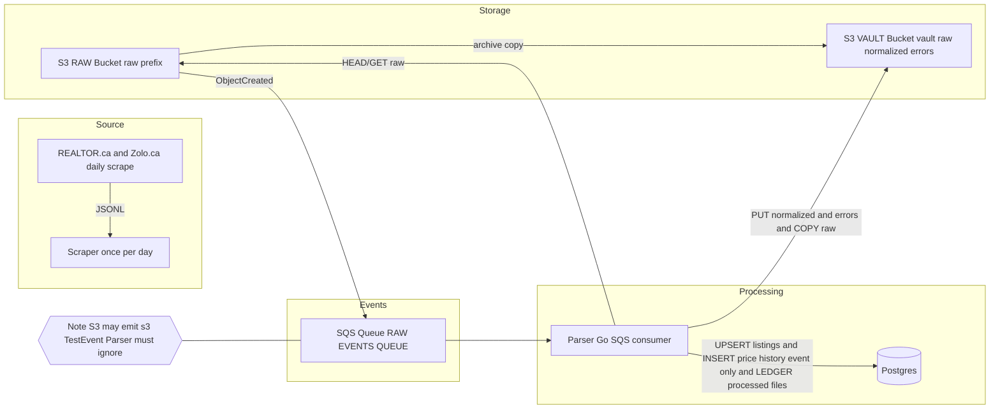

# Calgary Real Estate Monitor

A local-first, AWS-compatible pipeline to **observe the Calgary real-estate market over time** by ingesting daily REALTOR.ca and Zolo.ca snapshots, deduplicating physical properties, and tracking meaningful changes.

## What this does (functional)

This project helps you answer questions like:
- “How are prices evolving in a given neighborhood / property type?”
- “What changed since yesterday?” (price, beds/baths/sqft, etc.)
- “How long do properties stay on the market?” (derived client-side if needed)

It does this by:
1) **Scraping daily** listing snapshots (JSONL files) from REALTOR.ca (HTTP-first with optional browser mode) and Zolo.ca (HTTP-first).
2) Writing raw snapshot files to S3 (LocalStack locally, AWS later).
3) Triggering parsing via **S3 → SQS events**.
4) Parsing + normalizing into Postgres:
   - `listings`: latest state per physical property
   - `price_history`: **event-only history** (only when something changed)
5) Archiving artifacts to a vault bucket for audit/restore:
   - raw copy
   - normalized output
   - errors/rejects

### Non-negotiable invariants

- **Idempotent ingestion**  
  Reprocessing the same S3 object must not create duplicates. We identify processed objects by:
  - `(s3_bucket, s3_key, etag)` in `processed_files`.

- **Event-only history**  
  We write to `price_history` only when a **snapshot_hash changes** (URL is excluded to avoid noise).  
  A daily time series can be reconstructed client-side by forward-filling.

- **Identity is computed in the parser**  
  `property_key` is derived from normalized `address` + optional `unit` + optional `postal_code` (postal is not required).

- **Raw bucket immutability by convention**  
  We do not move/delete raw objects after processing. Auditability comes from `processed_files` + the vault.

- **Vault mapping (deterministic)**
  For a raw object key `<original-key>`, vault artifacts are:
  - `vault/raw/<original-key>`
  - `vault/normalized/<original-key>.normalized.jsonl`
  - `vault/errors/<original-key>.errors.jsonl`

## Architecture

## Quickstart
1) Follow prerequisites: docs/prerequisites.md
2) Start infra:
   - make infra-up
   - make infra-status

3) Initialize LocalStack:
   - ./scripts/init-localstack.sh
4) Optional smoke test:
   - ./scripts/smoke-s3-sqs.sh

Note: S3 can emit an initial s3:TestEvent to SQS; consumers must ignore it.

## Run scraper locally (LocalStack)
Dummy mode (uploads dummy JSONL to S3):
- export AWS_REGION=us-west-2
- export LOCALSTACK_ENDPOINT=http://localhost:4566
- export RAW_BUCKET=calgary-raw-bucket
- export DRY_RUN=false
- cd services/scraper
- go run ./cmd/scraper

REALTOR.ca HTML scrape (free, no paid APIs):
- export SEARCH_ENTRYPOINT_URL=https://www.realtor.ca/ab/calgary/real-estate
- export MAX_PAGES=20
- export RATE_LIMIT_MS=500
- export USER_AGENT="RealtorAgentScraper/0.1"
- go run ./cmd/scraper

Zolo HTML scrape (HTTP-first):
- export SCRAPER_STRATEGY=zolo_ca
- export ZOLO_ENTRYPOINT_URL="https://www.zolo.ca/index.php?sarea=Calgary&filter=1"
- export ZOLO_BASE_URL="https://www.zolo.ca" # optional
- export MAX_PAGES=20
- export RATE_LIMIT_MS=500
- export USER_AGENT="RealtorAgentScraper/0.1"
- go run ./cmd/scraper

Notes:
- REALTOR.ca exposes hash (`#`) pagination for client-side map views; the scraper ignores hash links and follows server-side pagination discovered from the bootstrap HTML.
- Extraction is JSON-first (embedded `SEOLandingPageInitialResponse`) with DOM fallback when JSON is missing or empty.
- If you get HTTP 403 during live scraping, the next step is headless browser mode.
- Set `SCRAPER_SAVE_HTML_DIR` to save fetched HTML pages for debugging.
- Set `MAX_PAGES=0` to follow pagination until exhausted.
- Zolo uses HTTP-first scraping with rel=next pagination; if blocked or zero records, the scraper errors unless `FORCE_UPLOAD_EMPTY=true`.

## Robot blocks
If REALTOR.ca HTTP fetch yields tiny robot pages, switch to browser mode:
- export FETCH_MODE=browser
- go get github.com/playwright-community/playwright-go
- go run github.com/playwright-community/playwright-go/cmd/playwright install chromium
- ./scripts/run-live-scrape.sh

Browser options:
- `BROWSER_HEADLESS=true|false`
- `BROWSER_TIMEOUT_MS=30000`
- `BROWSER_WAIT_MS=5000` (extra wait after network idle)
- `BROWSER_USER_AGENT` (optional; defaults to `USER_AGENT`)

If browser mode still returns an interstitial with `ROBOTS NOINDEX`, the scraper returns `ErrBlockedByBotDefense` and skips upload unless `FORCE_UPLOAD_EMPTY=true`. Check `SCRAPER_SAVE_HTML_DIR` (page-*.html) and retry with `BROWSER_HEADLESS=false`.
Note: Zolo currently uses HTTP-only fetching (no browser mode).

## Test scraper upload
Run the LocalStack upload verification:
- ./scripts/test-scraper-upload.sh

## Repo structure
- infra/ (docker-compose, local aws emulation)
- services/ (scraper, parser, api later)
- docs/

## Parser tests
Run the integration tests against LocalStack + Postgres:
- make infra-up
- make infra-init
- make db-migrate
- ./scripts/test-parser.sh

## ReadAPI integration tests
- App/runtime DB: `realestate`
- Integration-test DB: `realestate_it` (created and migrated automatically)
- Safe command: `make test-readapi-integration` (does not touch `realestate`)

## End-to-end pipeline test (deterministic)
Runs a full pipeline using the local fixture (no live scraping):
- make test-e2e

Notes:
- Tests create and consume messages in the shared RAW_EVENTS_QUEUE.
- Consumers must ignore initial s3:TestEvent messages.

## Manual local run (Zolo)
One-shot manual run (live scrape + parser + verification):
- make infra-up
- make infra-init
- make run-zolo

Note: `make run-zolo` is the one-shot command; the infra steps are shown for clarity.

## Local app run (real data)
- `make run` launches infra + ReadAPI + Flutter (apps/client).
- If the DB is empty, it runs one real scrape automatically.
- Force a refresh: `RUN_SCRAPE=true make run`.
- Confirm real data:
  - `curl http://127.0.0.1:8090/healthz`
  - `docker exec -i calgary-realestate-infra-postgres-1 psql -U realestate -d realestate -tAc "select count(*) from listings;"`
  - In the UI, total > 0 and `last_seen_at` reflects recent scrape timestamps.

Logs live under `./tmp/run/`.

## ReadAPI value score
- `/v1/listings` supports `sort=value_desc`.
- `ppsf_percentile` is the percentile of price-per-sqft within its comps group (0=best value, 100=worst).
- `value_score` is the inverse of percentile (100=best value).

## Unit tests
Run fast, hermetic unit tests locally:
- go test ./...
- go test -race ./...
- go test ./... -run TestNormalizeLineValid
- go test ./... -fuzz=FuzzNormalizeAddress -fuzztime=10s
- go test ./... -coverprofile=coverage.out && go tool cover -func=coverage.out
